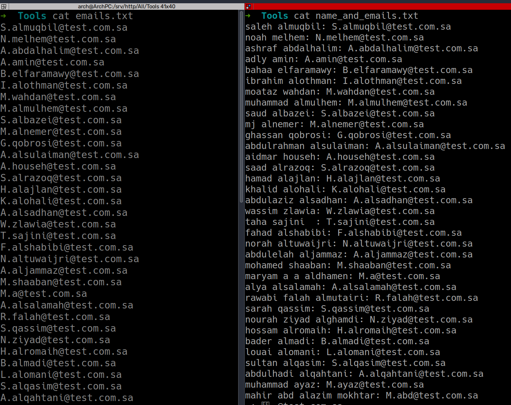

<!DOCTYPE html>
<html>

<body>
  <h1>Email Generator</h1>

  
Generate emails from names in LinkedIn

  <ol>
    <li>Open LinkedIn and go to the company profile.</li>
    <li>Click on the "People" section.</li>
    <li>Load as many profiles as possible.</li>
    <li>Inspect and copy the HTML element as shown below:</li>
  </ol>
  

  
Then paste the copied HTML element into the <code>index.html</code> file.

  
Next, run the script:

  <pre><code>python3 getEmail.py</code></pre>
  

  
The script will generate two files: <code>email.txt</code> and <code>name_and_email.txt</code>.

  

  
The <code>email.txt</code> file contains a list of the generated email addresses, while the <code>name_and_email.txt</code> file provides a corresponding list of names and their respective email addresses.

  
Feel free to modify and enhance the script according to your specific requirements.

  
<strong>Note:</strong> Ensure that you have the necessary permissions and adhere to LinkedIn's terms and conditions when using this tool. Respect privacy and use the generated emails responsibly.

</body>

</html>
